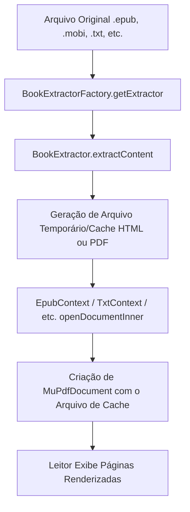

# Arquitetura do Módulo Ebook (Ebook Module Architecture)

🤖 **Applying knowledge of `@[documentation-writer]`...**

## 🎯 Propósito do Módulo
O módulo `ebook` é uma biblioteca Android que fornece mecanismos para extrair metadados, capas, conteúdos textuais e notas de rodapé de variados formatos de e-books e documentos. Adicionalmente, integra-se ao framework de renderização (derivado do EBookDroid e MuPDF) para construir a representação de leitura exibida nas telas principais do aplicativo BilingualReader.

## 🏗️ Padrão Arquitetural e Componentes
O módulo é estruturado em três pilares principais:

1. **Abstrações e Fábricas (`br.com.ebook.core`):**
   * Define contratos e modelos de dados comuns, como [BookExtractor](file:///e:/Proj/BilingualReader/ebook/src/main/java/br/com/ebook/core/BookExtractor.kt) e [BookMetadata](file:///e:/Proj/BilingualReader/ebook/src/main/java/br/com/ebook/core/BookMetadata.kt).
   * Orquestra a seleção do extrator correto via [BookExtractorFactory](file:///e:/Proj/BilingualReader/ebook/src/main/java/br/com/ebook/core/BookExtractorFactory.kt).
   * Expõe configurações globais por meio do [EbookSettings](file:///e:/Proj/BilingualReader/ebook/src/main/java/br/com/ebook/core/EbookSettingsProvider.kt).

2. **Extratores de Formato (`br.com.ebook.extractor`):**
   * Classes e objetos que implementam `BookExtractor` específicos para cada formato (ex: `EpubBookExtractor`, `MobiBookExtractor`, `PdfBookExtractor`, etc.).
   * Realizam o pré-processamento pesado dos arquivos originais e criam arquivos intermediários compatíveis na pasta de cache temporário.

3. **Contextos de Renderização (`org.ebookdroid.droids`):**
   * Estendem `PdfContext` ou `AbstractCodecContext` do framework de visualização.
   * Conectam-se aos extratores para converter dinamicamente os formatos (como EPUB, MOBI, TXT) em arquivos representáveis pelo renderizador PDF subjacente (`MuPdfDocument`), aplicando estilizações dinâmicas, hifenização e vinculando notas de rodapé (`setFootNotes`).

## 🗂️ Estrutura de Pacotes

* **`br.com.ebook.core`**: Contém a interface do extrator, factory, configurações e classes de dados de metadados e conteúdos de livros.
* **`br.com.ebook.extractor`**: Implementações concretas de extratores para formatos como EPUB, MOBI, DjVu, PDF, DOC, DOCX, ODT, RTF, HTML, HTMLz, PMLz, TCR, TXT, CBZ/CBR e metadados gerados pelo Calibre.
* **`org.ebookdroid.droids`**: Gerencia o ciclo de vida dos contextos de codec que o leitor usa para abrir e renderizar os e-books na tela do dispositivo.
* **`br.com.ebook.foobnix`**: Bibliotecas utilitárias internas e classes legadas para suporte a codecs de PDF, renderização, caches ZIP, hifenização, processadores de CSS e visualizadores de imagens.

## 🔄 Fluxo de Processamento de Leitura

## 📚 Dependências Principais
* **Jsoup (`org.jsoup:jsoup:1.18.3`)**: Utilizado para extrair, sanitizar e formatar tags HTML e converter metadados/notas em texto limpo.
* **juniversalchardet (`com.github.albfernandez:juniversalchardet:2.5.0`)**: Usado na detecção automática de encodings de texto para formatos raw (`.txt`, `.html`, etc.).
* **rtfparserkit (`libs/rtfparserkit-1.10.0.jar`)**: Parser local para ler arquivos no formato `.rtf`.
* **Coroutines (`kotlinx-coroutines-android:1.7.3`)**: Para operações assíncronas de I/O em background.
